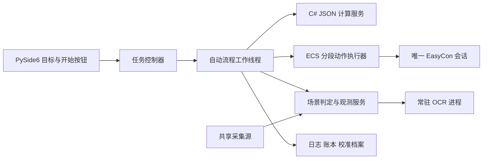
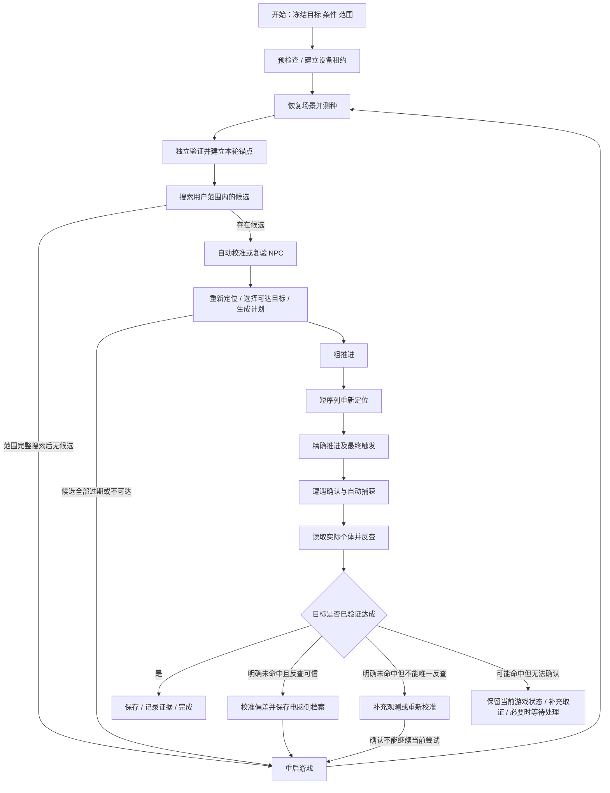

# 剑盾全自动乱数闭环实现方案

版本：1.1 · 2026-09-27
用途：供开发者直接拆分任务、实现和验收。本文只规定实现方案，不代表以下自动流程已经实现。
当前交付边界：本轮先完成离线实现、模拟器、录像回放入口、证据清单和实机执行接口等**框架验收**。需要真实 Switch、串口、采集卡和存档才能确认的结论统一保留为 `PendingHardwareValidation`，不得用模拟测试替代，也不得把入口标为正式全自动。
审计对象：`this repository`，基线提交 `4d798bdee0e1201722f58a60b8e39d3736943f9b`，并核对截至 2026-09-27 的现场工作区。工作区已出现协议 2、种子边界 / 重定位和 M2 搜索循环的部分实现；第 3、14、21 节按“已实现基础 / 框架待验 / 实机待验”区分，不再把全部协议 2 操作称为未实现提案。未提交改动只用于核对设计状态，不视为已交付。
算法基线：owoow `a8514d654ae6c7c4ad87c3647c9911a05f6ef42a`。中文资源继续使用 owoow 汉化版，具体维护方式见第 20 节。

本文使用两条独立状态轴：`frameworkStatus` 取 `NotImplemented/FrameworkReady`；`hardwareStatus` 取 `PendingHardwareValidation/HardwareValidated/HardwareValidationFailed`。`FrameworkReady` 表示接口、离线算法、模拟 / 回放、失败分支和证据占位均已通过；`HardwareValidated` 表示指定设备、存档和场景的实机证据已通过审核。只有 `FrameworkReady + HardwareValidated` 才可在正式入口中宣称支持该场景。

截至 2026-09-27 的代码落地和未完成项见[框架实现状态](automation-framework-status.md)。方案表格描述目标能力；该状态页区分当前已落地的离线模块和未实现的验收门槛。

阅读导航：[产品流程](#1-最终产品行为) · [位置与帧数语义](#2-必须先统一的概念) · [代码缺口](#3-现有工程能力与缺口) · [测种](#7-测种与重定位) · [NPC 校准](#9-自动校准-npc-参数) · [捕获反查](#12-捕获后反查命中帧) · [延迟反馈](#13-自动校准延迟与重复尝试) · [接口](#14-数据与接口契约) · [测试](#19-验证方案与测试清单) · [开发顺序](#21-开发顺序与交付门槛)。

## 1. 最终产品行为

用户选择目标宝可梦，设置筛选条件和帧数范围，点击一次“开始”。程序随后自动执行：

1. 进入测种页面，识别动画，获得并验证当前种子。
2. 在用户填写的范围内搜索符合全部筛选条件的目标。
3. 范围内没有目标：自动关闭并重新启动游戏，重新测种、搜索，持续循环。
4. 找到候选目标：自动校准当前场景的 NPC 参数，核对目标仍可到达。
5. 自动进行大跨度推进、重新定位、精确推进。
6. 执行场景对应的关菜单、移动、刷怪及撞帧动作。
7. 自动进入战斗并捕获宝可梦。
8. 识别捕获结果，反查实际命中的生成帧，判断目标是否达成。
9. 未命中：使用可信的反查结果校准执行偏差，恢复起点，重新执行整个闭环。
10. 命中：保存宝可梦、记录证据、释放按键，显示完成。

正常运行时，用户不需要复制 0/1 序列、手填种子、选择某一行目标、填写 NPC 数、手算剩余推进数、手动抓怪或手工修改延迟。“运行了脚本”不是完成标准，“捕获并验证符合筛选条件的目标”才是。

每轮都沿用启动时冻结的筛选条件和范围。程序不得为了更容易命中，擅自放宽 IV、闪光、性格、特性、证章或范围。

### 1.1 一次性准备与每轮自动操作

一次性配置存档、设备和场景方案是必要前提，不应在每轮弹窗重复询问：

| 用户一次性准备 | 程序每轮负责 |
| --- | --- |
| 版本、内部 TID/SID、护符、图鉴推荐等存档信息 | 按冻结配置调用计算服务 |
| 串口、采集卡、游戏语言、图像标签和 OCR 模型 | 检查连接、画面新鲜度、页面状态 |
| 保存于已支持场景的指定位置、朝向及队伍状态 | 从该存档恢复测种起点 |
| 测种宝可梦、首发特性、捕获队伍、球及空余位置 | 测种、换位、推进、撞帧、捕获和读取结果 |
| 关闭会破坏重试起点的自动保存，保留可重复加载的起点存档 | 未命中时不覆盖起点，成功后保存 |

主界面每次运行只要求目标、筛选和范围；场景、设备、存档使用已选方案。无法确认必要的场景配置时，应在“开始”前一次列出缺项。

### 1.2 支持范围的实现顺序

先用一个固定位置、固定路径、普通天气、可重复捕获的明雷场景完成**全部十步**。在这个闭环验收通过后，再增加其他地点、雷雨、固定怪、暗雷、垂钓的场景执行器。

计算器支持某种遭遇，不等于自动操作已经支持该遭遇。每种场景必须有自己的起点、生成触发方式、NPC 实验、过帧策略、捕获路径和恢复验证。未配套执行器的场景在开始前明确显示“自动流程未支持”，不能套用通用摇杆方向继续运行。

## 2. 必须先统一的概念

### 2.1 RNG 推进次数、视频帧和毫秒分开

本文的用户“帧数”定义为主 RNG 的推进次数，界面显示“RNG 推进范围”。它不是采集卡视频帧数，也不是经过的时间。

| 符号 / 字段 | 定义 |
| --- | --- |
| `runId` | 用户点击开始至结束的一次自动任务 |
| `epochId` | 一次启动游戏并建立种子锚点的周期；重启游戏必须更换 |
| `attemptId` | 某个候选目标的一次撞帧、捕获及验证尝试 |
| `anchorState = S0` | 本次测种和独立验证全部完成后，位于已确认稳定页面的 RNG 状态 |
| `S(a)` | 从 S0 用原算法向前推进 a 次得到的状态 |
| `[minAdvance, maxAdvance]` | 用户范围，包含两个端点，以本 epoch 的 S0 为 0 |
| `currentAdvance = c` | 当前状态相对 S0 的位置；只有观测确认后才标为“已确认” |
| `targetGenerationAdvance = g` | 目标遭遇生成器开始执行前的状态位置；这是用户范围约束的对象 |
| `preTriggerAdvance = p` | 最后一段关菜单 / 触发动作开始前，应停下的位置 |
| `observedGenerationAdvance = h` | 捕获结果反查得到的实际生成位置 |
| `videoFrameId`、`capturedAtNs` | 采集帧序号、主机单调时钟接收时间 |
| `delayMs` | 某一段输入或等待的时间参数，不能直接当作 RNG 推进次数 |

128 次测种和额外验证发生在 S0 之前。建立锚点之后，NPC 实验、重定位动画、菜单操作、天气等新增消耗都要进入同一本推进账本，不能只累计“过帧脚本循环次数”。

### 2.2 范围不在中途移动

例如用户填写 `[1,000, 50,000]`，NPC 校准后已经推进到 1,500，本 epoch 后续可选目标仍必须落在原来的 `[1,000, 50,000]`。不能把范围重新解释成“从现在再过 1,000～50,000”。

重启游戏并获得新种子后，才建立新的 S0，并重新使用用户原始范围。候选被校准过程消耗掉时，选同范围中的下一候选；全部不可达时重启。

### 2.3 目标生成时刻与碰撞时刻

“撞帧”在产品上是一段自动遭遇动作，在内部必须拆清其生成触发点。不能默认任意场景都在碰到模型的那一刻生成个体；已经存在的野怪也不能默认会因之后的碰撞重新生成。

每份场景方案声明 `generationBoundary`：例如经过验证的关菜单后刷新、进入生成范围、固定触发点等，并给出从稳定能力页到该边界、再到战斗的动作和证据。实际边界由实机实验确定。

本地 owoow `Symbol` 在运行遭遇生成前，可以先执行雨天、飞翔和关菜单预测；结果中的 `Advance` 与 `Jump` 因此必须解释清楚：

- 本方案初筛使用关闭这些前置预测的生成器，直接在 g 处预测目标；此时原始 `Advance` 就是 g。
- NPC 校准后，由规划器求满足完整前置动作模型的 p，使模型结束于 S(g)。
- 若以后使用启用前置预测的搜索结果，须在适配层统一换算并校验 `g = p + Jump`，返回两个独立字段。
- 已在生成器中计入的 NPC / 天气消耗不得再手动扣一次。

这一约定使“先搜索候选、后自动校准 NPC”的流程成立：初筛搜索的是可能的生成状态，NPC 校准解决的是如何到达这个生成状态。

## 3. 现有工程能力与缺口

以下是代码审计结果，不把文档中的“适配完成”当作自动闭环已完成。

| 能力 | 现状 | 需要补充 |
| --- | --- | --- |
| PySide6 目标、范围、条件输入 | 已有中文搜索界面 | 将输入冻结为自动任务配置；统一开始 / 停止和状态展示 |
| owoow 遭遇搜索 | 已有 `IOverworldEncounterService` | 返回完整场景条件、生成位置语义和搜索完整性标志 |
| 当前桌面 JSON 接口 | 工作区协议 2 已开放 `capabilities/catalog/search/rng/rng.advance/rng.distance/seed.solve/seed.verify/seed.locate` | 补候选结果分页、校准探测、动作规划与反查；现有工作区实现仍须提交及回归后才算交付 |
| 128 位动画解种 | 工作区已增加观测前后边界、独立序列验证和离线固定用例 | 补自动实机采集、录像回放证据和场景级硬件验证 |
| 动画重定位 | 工作区已增加包含端点与重叠匹配的完整候选适配 | 补协调器消耗记账、录像回放和实机观测验证 |
| NPC / 关菜单消耗 | `ICalibrationService` 能计算给定 NPC 参数的结果 | 通过实机实验自动识别 NPC 参数，不能把现有预测接口称为自动校准 |
| 雨天 / 区域加载预测 | C# 层已有部分参数 | 补全桌面协议和阶段参数，验证与实际路线一致 |
| EasyCon | Python 原生协议、脚本、串口互斥已有 | 全任务设备租约、分段动作结果、结构化事件 |
| 九项统合 ECS | 可手选功能、等待有界 | 做成自动流程可调用的动作库；不能依靠人工切换 `_功能` 串联 |
| 采集画面 | `FrameStore` 保存最新图像和更新时间 | 帧序号、不可变快照、因果关联、冻结检测和取证缓冲 |
| OCR | 独立进程、ROI、文本和置信度已有 | 捕获结果页面导航、字段约束、多帧融合与候选识别 |
| 捕获与命中反查 | Python 已有离线状态机、身份差异识别、多帧观测、反查请求构造和三值目标判定；请求已与 CLI 做合成端到端联调 | 接入回放战斗模拟器 / 总协调器，补端到端故障注入 |
| 延迟反馈与重试 | 未有完整实现 | 偏差归因、模型版本、受限更新、失稳回退 |
| C# 自动流程草稿 | 本地可见生命周期 / 单脚本执行容器 | 不应与 Python 同时持有两套自动流程及同一串口 |

本表描述的是 2026-09-27 工作区快照，不是发布承诺。实现继续变化时，应更新表中状态或记录对应提交，避免开发者按过期缺口重复实现。

### 3.1 必须封住的源码语义问题

1. 基线提交中的 `FindExactAsync` 直接转发 `CalculateRetailSeed`，没有声明返回的是第几个观测边界的状态。当前工作区已用已知种子固定用例证明原始结果位于最后一位观测之后，并增加 `stateBeforeObservations/stateAfterObservations`；交付时必须保留这项测试和语义版本，不能凭名称再固定加 128。
2. 当前 `SeedFinder.ReidentifySeed` 对最后一个合法匹配起点、重叠匹配和位置返回有需要独立测试的边界：循环使用严格小于，命中后跳过一段，推进位置与状态跳转分别使用 `pos + 1` 和 `pos`；非零序列起点也需要归一化。现有“与上游结果相同”的测试不足以证明闭环所需语义正确。
3. 当前工作区已新增项目侧“完整候选重定位”适配：枚举所有合法匹配起点，包含末端和重叠匹配，并按绝对位置重新计算观测前、后的状态。合并前必须确认固定用例覆盖端点、重叠和非零窗口，业务层不得退回旧 `Hits == 1`。
4. `GetAdvancesPassed` 到上限时也返回一个数字。当前工作区距离服务已另外验证结束状态并返回 `found`；合并前保留“刚好到上限 / 超过上限 / 零距离”测试，搜索到上限仍不能等同于确认找到距离。
5. 当前桌面搜索硬编码 `OverworldEnvironmentSettings.None`，没有传入首发特性、推荐槽等完整上下文；JSON 返回也未包含 `Jump`。普通手工搜索能返回结果不代表自动流程条件已完整。
6. 现有单次搜索限制为 100,000 个位置、显示截断为 10,000 行。自动流程不能从显示列表判断“范围没有目标”，必须看计算是否完整完成。
7. 首发影响还涉及结果解析：当前上游会用 `C` 表示迷人身躯条件结果，用 `Sync` 表示同步性格；当前项目性别映射把非 M/F 全映射为无性别。自动方案必须携带首发性别 / 性格，并按原机制解析这些条件结果，再执行最终筛选和反查；不能把标记当成真实无性别或普通性格。必要时让上游对应字段保持宽筛选，在项目适配层解析后应用用户的精确条件，并保留原始标记供检查。

## 4. 总体结构和职责

采用“Python 自动协调器 + ECS 动作库 + C# owoow 计算服务 + 共享识别服务”。RNG 算法继续只在 C# / owoow 中存在。



具体约束：

- Qt 主线程只处理界面、QProcess 生命周期和信号，不进行脚本等待、图像循环或算法搜索。
- 自动流程工作线程串行推进业务状态。它向主线程的计算 / OCR 调度器发请求，通过带取消能力的结果对象等待；不能跨线程直接操作已在主线程创建的 QProcess。
- 每个异步结果携带 `runId/epochId/requestId/contextRevision`；迟到结果只有身份和版本都一致才能提交。
- `ControllerSession` 仍是唯一设备所有者。整个自动任务持有上层运行租约，防止两个脚本之间被手动按键插入。
- 上层租约与现有单次设备互斥锁分开，避免“先锁住 gate，再调用会再次获取 gate 的 run()”造成死锁。
- 临近最终触发时，所需搜索和计划必须已经计算好。最后一段输入在同一个执行器中完成，不在敏感时序之间启动 .NET 或等待 OCR 冷启动。
- 运行中的配置是不可变快照。用户修改界面只影响下一次任务，或者明确停止后重新开始。

### 4.1 建议目录

```text
desktop/swsh_app/automation/
    models.py                # 配置、账本、候选、观测、结果和失败码
    controller.py            # Qt 桥、开始停止、任务级设备租约
    runner.py                # 唯一业务状态机
    calculator_client.py     # 请求 DTO、结果验证、异步身份校验
    scene_guard.py           # 场景识别、稳定检测和转场确认
    seed_observer.py         # 动画采样、未知状态和独立验证
    stage_executor.py        # ECS 参数注入、结构化事件、取消
    planner.py               # 阶段选择、剩余推进预算和候选优先级
    npc_calibration.py       # 实验调度、候选参数收敛与复验
    capture_flow.py          # 战斗、投球、捕获和结果页导航
    encounter_observer.py    # OCR 字段融合与可观察属性约束
    calibration.py          # 延迟 / 偏差档案和更新策略
    journal.py               # 每轮状态、证据和版本记录

desktop/scenarios/<scenario-id>/
    profile.json             # 起点、路线、适用条件、观测能力
    labels/                  # 用户补充的图像标签
    routes/                  # 自动调用的 ECS 动作段

src/AutoSwshRng.Core/AutomationRng/
    SeedObservationContracts.cs
    FramePlanningContracts.cs
    EncounterObservationContracts.cs
    ReverseLookupContracts.cs

src/AutoSwshRng.Upstream/
    OwoowObservationService.cs
    OwoowFramePlanningService.cs
    OwoowReverseLookupService.cs
```

以上是建议新增路径。尽量通过现有接口复用实现，不要求为了目录整齐搬动已稳定工作的代码。

## 5. 主状态机



主图没有展开所有异常边：任意状态都能进入停止；可恢复的识别超时进入该阶段恢复；设备断线、身份混乱、持续无法识别或可能丢失已捕获目标时进入等待处理。

| 状态 | 进入条件 | 产出 / 正常出口 | 失败处理 |
| --- | --- | --- | --- |
| `Preflight` | 用户配置完整 | 冻结的任务配置、版本指纹、场景框架 / 实机状态 | 汇总缺项；正式模式遇到非 `HardwareValidated` 场景时禁止启动 |
| `RestoreScene` | 可识别的标题 / 游戏页面 | 测种页面与正确队伍位置 | 有限次菜单恢复，失败停止等待 |
| `ObserveSeed` | 动画页面已稳定 | 128 位观测及图像证据 | 同次动画重读，不能补造 0/1 |
| `VerifySeed` | 得到候选种子 | 独立验证通过、S0 | 不通过则重新测种 |
| `SearchTargets` | 当前 epoch 有有效 S0 | 完整搜索结果或可继续分页的候选 | 超时重试计算，不能冒充无目标 |
| `CalibrateNpc` | 至少一个初筛候选 | 参数候选收敛 / 缓存复验成功 | 追加实验，仍不辨识则暂停 |
| `PlanAttempt` | 当前状态可信 | 不越界且可执行的目标与动作计划 | 换下一候选；没有则重启 |
| `AdvanceCoarse` | 粗推进收益为正 | 执行估计与恢复后的稳定页面 | 有限恢复，状态失信后重测 |
| `Relocate` | 可安全读短序列 | 唯一的观测后状态、更新 c | 加长观测或重测，不猜位置 |
| `AdvanceFine` | 剩余数含全部必要预留 | 最后已确认检查点 | 目标已越过则换候选 / 重启 |
| `TriggerEncounter` | 动作计划已准备完毕 | 已确认的遭遇 / 战斗 | 意外对象或路径失效则记录失败 |
| `Capture` | 战斗页面与对象已确认 | 本次新捕获个体的身份 | 逃脱续投；倒下 / 球尽等单独恢复 |
| `ObserveEncounter` | 新捕获个体可定位 | 带未知值与置信度的实测属性 | 有限重读，不能把未知当“不满足” |
| `ReverseLookup` | 本次尝试快照完整 | 候选生成帧集合与完整性信息 | 零结果扩窗 / 查上下文；多结果取证 |
| `UpdateCalibration` | 唯一可信样本且明确未命中 | 新模型版本 / 拒绝更新原因 | 异常样本留档，不改模型 |
| `Restart` | 无目标、不可达或明确未命中 | 新 epoch | 确认退出及加载，禁止无限按 A |
| `SuccessCommit` | 目标达成有证据 | 保存确认、终态成功 | 保存未确认时留在当前游戏重试 |

`Succeeded`、`Cancelled`、`NeedsAttention`、`Failed` 是不同终态。自动流程不得在某段 ECS 正常退出时就把整个任务标为成功。

## 6. 配置模型

### 6.1 自动任务配置

`AutomationConfig` 至少包括：

| 分组 | 必要字段 |
| --- | --- |
| 目标 | 物种 / 形态、闪光条件、六项 IV 约束、性格、性别、特性、证章；其他已支持筛选同样原样传递 |
| 范围 | `minAdvance`、`maxAdvance`、`rangeOrigin = PostSeedVerification`，含端点 |
| 存档 | 剑 / 盾、内部 TID/SID、闪耀 / 证章护符、击败数、图鉴推荐及首发影响 |
| 场景 | `scenarioId/revision`、地区、天气、遭遇类型、存档起点及朝向、队伍方案 |
| 推进 | 允许的推进方式、重定位策略、设备时序档案 |
| 捕获 | 捕获队伍、球优先级、战斗策略、回合 / 投球上限、新个体定位方法 |
| 重试 | 找目标 / 未命中重试默认持续到成功或用户停止；单阶段恢复次数有上限 |
| 证据 | 图片保留、关键视频片段、日志目录、空间配额 |
| 版本 | 算法 SHA、协议版本、场景 / 脚本 / 标签 / OCR / 校准模型指纹 |

默认不要求用户输入 NPC 数和固定预留帧。它们属于自动校准与规划结果。调试页可以显示和覆盖，但覆盖必须显式标记并进入日志。

### 6.2 场景方案

`ScenarioProfile` 是全自动能否成立的核心，不应只有“撞帧方向”一个参数。至少描述：

- 适用的版本、地区、天气、遭遇类型和生成边界。
- 存档加载后的地标、角色朝向、相机状态、菜单和队伍光标起点。
- 测种对象的两类动画、物理 / 特殊动画与 0/1 映射。
- 可确认 RNG 稳定的页面；菜单是否能隔离环境消耗必须实测。
- NPC 探测动作链、对应的数学模型以及未知干扰项。
- 光速 / 原地 / 自行车推进的进入前提、正常出口与失效检测。
- 雷雨日期切换的实际年份、月份、日期和恢复规则；不能继续沿用旧脚本的固定示例日期。
- 刷怪、选中目标实体、走向目标和进入战斗的路线。
- 首发换位、同步 / 迷人身躯等影响，以及这些动作应位于哪个账本阶段。
- 捕获、结果查看、未命中后恢复起点、命中后保存的路径。
- 标签清单、OCR 字段清单、可独立验证的目标属性和实机验收状态。
- `frameworkStatus`、`hardwareStatus`、证据清单版本及最后一次验收所绑定的算法 / 脚本 / 设备指纹。

若只能在特定位置使用时间 bug，场景方案必须包含其准备及有效性检查。游戏重启后不假定 bug、队伍光标或网络状态仍然有效。

场景状态必须由运行时强制执行：`FrameworkReady + PendingHardwareValidation` 只允许进入诊断、模拟和录像回放入口；只有 `HardwareValidated` 且版本指纹匹配的场景才出现在正式全自动入口。证据缺失、版本失配或状态未知时默认降级，不能依靠界面文案提醒后仍继续发键。

## 7. 测种与重定位

### 7.1 动画观测流程

对每一次预期动画执行以下步骤：

1. 确认处于正确宝可梦的能力页，并确认上一次动画已结束。
2. 记录 `observationIndex`、动作编号及动作发送时间。
3. 执行一次经场景验证的动画触发。
4. 只接收属于该动作之后的新画面；同时检测页面和动画开始 / 结束，避免把同一张缓存图识别多次。
5. 对多个有效采集帧分别计算两类动画得分，结合“得分差”和时间窗判断 0、1 或未知。
6. 得分不足、两类都相似、页面错误、画面冻结都返回未知。旧脚本“匹配不上就记 1”的办法不适用于无人值守。
7. 同次动画优先重读缓存片段；如果画面已经错过，不能再按一次后把新结果填回原位。要么显式记录消耗缺口并由支持缺口的算法处理，要么放弃这段观测重新采集。
8. 每次观测记录使用的帧编号、分数、是否发送成功、是否观测到独立动画周期。

先用图像 / 动画分类识别 0/1，普通 OCR 不承担动画判别。用户补标签时，需要两种动画和未知 / 空闲状态的样例，而不只是一个“铁甲物理”正样本。

### 7.2 128 位解种和独立验证

1. 收集一段连续、无缺口的 128 位序列。
2. 调用当前 owoow 算法解种，返回原始算法结果与标准化边界说明。
3. 再采集一段独立验证序列。可从 16～32 位开始，具体长度属于可调整工程参数。
4. 使用解出的状态预测这段新增序列，必须逐位吻合且动画消耗一致。
5. 验证通过后，将最后一位观测完成后的状态设为 S0，建立 epoch 的零点。

128 位序列能够被转换为某个状态，并不能证明视觉识别正确。独立验证不可省略。全 0、全 1 等异常分布可触发重新检查，但不能单凭分布把它改成其他序列或认定种子正确。

### 7.3 已知种子的短序列重定位

设观测到长度为 L 的连续序列 B，需要在本 epoch 的 `[u, v]` 内寻找**第一位观测前**的位置 a：

```text
Candidates = { a ∈ [u, v] | PredictBits(S(a), L) == B }
```

为覆盖起点 v，需要生成到 `v + L - 1` 对应的输出；搜索必须包含端点及重叠匹配。

- 唯一候选 a：本次观测后当前推进位置是 `c = a + L`，状态是 `S(c)`。
- 多候选：在同一观测串尾部继续追加动画，重新筛选全部候选，不取“离预期最近”的那一个。
- 无候选：先检查窗口是否完整及观测是否可信；受限扩大窗口，再失败则完整重测。
- 若追加观测已经使原目标不可达，即使定位成功也必须换目标。

窗口推荐由粗推进估计值、经验误差范围及最后一个可信检查点共同产生。重定位默认从约 32 位开始，允许逐步加长；这些长度不是所有场景通用的正确常数。

每次重定位保留 `windowStart/windowEnd/matchStarts/observedLength/stateAfterObservation`，不只保留一个“推进数”。

## 8. 自动搜索与无目标重启

### 8.1 搜索规则

使用 S0、冻结的存档和场景上下文，在用户范围内调用原遭遇生成器。初筛不混入尚未校准的 NPC 消耗，按第 2 节返回候选生成位置 g。

候选结果至少保存：g、生成前状态、预测物种 / 形态、等级、性别、特性、性格、IV、闪光、证章及生成器提供的其他属性。PID / EC 可以作为预测值保留，但不得冒充从游戏画面读取到的观测值。

优先选可达且预计耗时较少的候选；候选必须留够 NPC 实验、重定位及最终动作的消耗预算。没有经验预算时，首个候选只是暂定，校准完成后再决定。

范围较大时自动分块，遵守当前接口每次最多 100,000 个位置的限制。必须把“推进范围扫描进度”和“已命中候选的返回分页”拆成两套游标，不能让一个 `complete` 同时承担两种含义：

- `scanComplete`：请求承诺的推进区间已经全部计算；`nextScanCursor` 指向下一个尚未扫描的绝对推进位置。
- `candidatePageComplete`：当前扫描快照中的候选行已经全部返回；未完成时必须给出 `nextCandidateCursor`。
- `candidateCursor` 绑定 `epochId`、请求条件摘要、算法 SHA、扫描区间和稳定排序版本。候选按 `(generationAdvance, candidateOrdinal)` 排序，重复请求不得漏行或换序。
- `totalCandidates` 是该扫描区间的总命中数；返回行数小于它时，规划器必须继续候选分页或把区间细分后重取。
- `truncated` 只可作为旧接口 / 展示层提示，不能作为规划器永久丢弃其余候选的机制。
- `cancelled/error`：本次搜索无业务结论，两个游标都不得推进。

找到足够候选后可以提前规划，但要保留扫描和候选分页快照。若已返回候选后来不可达，先取回同一快照中尚未返回的候选，再继续未扫描的推进范围。只有 `scanComplete = true` 且 `totalCandidates = 0`，才能下“无目标”结论；只有扫描完整、全部候选页均已枚举且每个候选都有不可达理由，才能下“范围内无可达目标”结论。

### 8.2 重启路径

场景执行器执行“HOME → 选中当前游戏 → 关闭确认 → 确认已经关闭 → 启动 → 标题 / 继续 → 存档加载 → 测种页面”。每次页面转换都有独立检测、超时和重试上限。

重启成功后：

1. 废弃旧 `epochId`、S0、当前位置、旧目标和未完成观测。
2. 清理迟到的 OCR / 计算结果，创建新 epoch。
3. 保留电脑侧校准档案，但重新验证场景和档案适用性。
4. 重新执行测种及独立验证，不假设重启后种子必然与上一轮不同。
5. 如连续多轮种子及画面完全相同，检查是否真的关闭 / 加载了游戏；不能把这视为已经完成多次有效重启。

Switch 系统日期不会因为重新加载游戏存档就自动恢复。执行过改日期推进后，必须按场景方案独立恢复 / 核对系统日期与游戏天气，再测种；网络状态、喷雾等额外状态也不能默认与存档起点完全一致。

未命中后默认也走该恢复路径，以原存档恢复球、队伍和站位。初版不实现从任意战后位置自动沿路返回；后续可加经过单独验收的快速恢复路线。

“持续重启直到范围有目标”是正常业务循环，可不设轮数上限；识别错误、连接失败、配置不成立的循环必须有上限并转入等待处理。

## 9. 自动校准 NPC 参数

### 9.1 校准的对象

校准的是原算法 `MenuClose` 使用的 NPC 参数，不是画面上肉眼可见角色的数量。不同地点、加载状态或移动路线可能影响这一参数。

当前原算法对每个 NPC 调用 `NextInt(91)`，并依据是否保持方向、天气执行其他调用。因此应逐个候选参数调用原算法比较状态，不能写成“每个 NPC 固定多消耗一帧”。参见本地 [MenuClose.cs](third_party/owoow/owoow.Core/RNG/Generators/Misc/MenuClose.cs)。

NPC 档案键建议包括：游戏 / 地区 / 子区域、路线版本、天气、菜单动作、是否保持方向、起点与相机状态、首发方案和算法 SHA。它只在这个上下文中有效。

### 9.2 实验流程

每组校准实验：

1. 在经过验证的稳定能力页建立可信状态 `S_before`。
2. 执行固定的探测动作，例如关闭菜单、固定短等待、重新进入能力页。
3. 记录整段操作的按键、实际发送时间、转场识别与场景变化。
4. 采集短序列，定位**第一位观测前**的 `S_after_probe`；随后产生的观测消耗另计。
5. 枚举候选 NPC 数 N，用原算法模拟整段探测动作。
6. 比较预测结束状态与实测状态，留下相符的候选。
7. 在新的已知 RNG 状态下重复实验；已有多个候选时选择更能区分它们的实验，而不是反复验证同一个等价样本。

建议初始范围 `N = 0..64`，完成 3 组观测后评估是否收敛，再用 2 组独立状态复验。范围和样本数是工程起始参数，应可配置，不是对游戏场景的事实断言。

### 9.3 必须模拟整个探测动作

探测链可能包含重新打开菜单、切换页面、天气、区域加载等消耗。模型应是按实际顺序组合的状态转换：

```text
PredictedAfter = ProbeModel(S_before, N, weather, holdDirection, routeTiming)
```

不能拿整段实测差值直接和一次 `MenuClose` 比较，再把所有多出来的消耗当成 NPC。

需要对测种动画本身、开菜单路径和固定转场先做对照实验。无法独立确认的项必须列为模型中的有界干扰参数，并检查 N 与这些参数是否可辨识。

对第 j 组观测，可形成候选集合：

```text
Cj = { (N, nuisance) | ProbeModel(Sj, N, nuisance) == ObservedAfterj }
C = C1 ∩ C2 ∩ ... ∩ Ck
```

- 唯一且独立复验通过：采用。
- 多组参数仍等价：继续设计区分实验，不能取最小 N。
- 所有候选都不匹配：先复核种子、观测、完整动作模型和天气，再受限扩展候选范围。
- 始终不可辨识：场景校准尚未成立，进入等待处理；不能把误差转移到“延迟”后继续宣称已自动校准。

### 9.4 校准消耗和缓存

实验及其短序列观测都更新当前账本。校准完成后重新选择仍在原用户范围内、且留有执行预算的目标。

下轮同场景可先复验缓存参数；复验失败立即使缓存失效。改变天气、区域、路线、首发影响、算法版本或实测误差分布后必须重新校准。

若用户范围短到无法容纳最小校准和触发消耗，应显示“当前范围没有可执行空间”及测得的最小预算。不能不停重启等待一个物理上无法到达的目标，也不能自行扩大范围。

## 10. 推进规划与最终撞帧

### 10.1 动作模型

将动作分成四类：

| 类型 | 例子 | 位置管理 |
| --- | --- | --- |
| 已验证的确定性动作 | 在指定页面执行一次有效动画 | 根据模型增加消耗，并由检查点验证 |
| 可计算但依赖状态的动作 | 关菜单、雨天、区域加载 | 输入当前状态调用 owoow 模型 |
| 高吞吐但误差较大的动作 | 光速 / 原地 / 自行车推进 | 只形成估计位置和误差范围，之后必须重定位 |
| 未建模动作 | 意外战斗、失控移动、未知页面恢复 | 当前位置失效，禁止沿用原计划继续 |

旧脚本的循环数量、`次数×5`、初始操作算一次等，只能作为待验证的执行参数映射，不能直接升级为统一的物理推进定律。

### 10.2 求触发前位置

设完整触发链的确定性预测消耗为 `M(S(p), context, timing)`；设 `b` 为绑定到该动作边界、由可信历史样本估计的“模型外额外推进数”，正值表示实际通常比纯模型多推进。规划器寻找：

```text
p + M(S(p), context, timing) + b = g
```

没有已复验偏差档案时 `b = 0`。M 可能随 p 的 RNG 状态变化，因此采用有界枚举 / 原算法模拟求解，而不是先用某个平均值计算 `p = g - 常数` 后一直复用。

`b` 只在其声明的动作边界应用一次，不能同时塞进 M 和额外扣帧。可同时保留多个可行 p，选择最稳健且尚可到达的一个。

### 10.3 粗推进

1. 根据当前确认位置 c、候选 p、方式吞吐量及误差界，计算粗推进数量。
2. 给重定位动画、页面返回和最终动作留出预算，预算采用实測误差上界或分位数，不只用平均值。
3. 检查时间 bug、系统日期、菜单起点等前提；没有有效条件时准备对应模式或改用已支持方式。
4. 按有界批次执行粗推进，记录批次结果及页面恢复。
5. 停在指定能力页，采集短序列重新定位，得到真实 c。

每次批量推进后重新计算，不能把“批量脚本正常返回”当作“精确到达某帧”。当前统合脚本的 `_推进后测种` 可作为参考，但自动动作段必须把观测消耗、结果和实际出口返回给协调器。

### 10.4 精确推进

在“动画一次消耗恰好一推进、页面稳定且动作已被游戏接收”的场景经过实测之前，不允许使用 `RCLICK 数量 = 精确推进数` 的假设。

完成验证后，精确阶段可使用：小批次数动画 → 确认 / 重定位 → 更新剩余数。最后一批不能因按键过快丢动画；应由页面动画周期确认或者使用实测保守间隔。

最后一个观测检查点必须安排在目标之前：观测本身会推进。如果剩余距离容纳不下验证，就更换候选，不能验证完后尝试“补回负帧”。

当 c 已越过可用 p 时，物理游戏不能通过计算器的 RNG 回退功能倒回去。选择下一候选或重启，数学回退只用于分析。

### 10.5 触发和撞帧

最终计划必须包含：

- 最后确认状态及其位置。
- 关菜单方式、是否按住方向、天气和 NPC 参数。
- 等待、摇杆方向 / 幅度 / 持续时间，以及每段预期的结束页面。
- 目标生成边界的证据、期望目标实体位置和进入战斗条件。
- 已存在野怪处理方式、遇到错误实体时的退出规则。
- 这次使用的偏差 / 延迟模型版本。

动作执行期间可以旁路记录视频，不能让 OCR 识别耗时随意插进敏感序列。依赖画面事件触发时，要将视频链路延迟、排队及识别波动作为该策略的显式参数。

## 11. 自动捕获和读取实际个体

### 11.1 捕获状态机

至少区分以下状态：进入战斗、对手展示、可操作战斗菜单、技能 / 道具选择、投球、摇球、挣脱、捕获成功、经验 / 升级提示、图鉴登记、昵称选择、入队 / 传盒选择、可查看新个体、异常结束。

每种状态按场景选择已验证动作，并等待对应结果。不能用无条件连续 A 假装覆盖所有提示。

捕获方案优先选经过验证的简单流程：合适的首发、球种、必要的削血 / 状态操作，以及投球失败后的续投。捕获不是必然成功，必须处理对手自伤 / 逃跑、我方倒下、天气伤害、球耗尽和队伍弹窗。

捕获发生在个体生成之后。投球回合中的 RNG 消耗不能算进“生成帧偏差”；反查必须使用进入本次遭遇前冻结的种子与场景快照。

### 11.2 新捕获个体身份

优先在起点存档预留一个可识别的队伍空位，使新个体进入确定位置。通过捕获前后的队伍差异、物种、等级和新位置确认身份。

队伍满时，必须实现并验证“指定接收盒 / 槽位 / 新捕获排序”的导航和身份校验。不能默认打开盒子第一个格子就是刚捕获的个体。

捕获成功标志与新个体身份是两个独立检查点。只看到捕获动画结束还不足以开始 OCR 反查。

### 11.3 观测字段与可观察性

| 字段 | 获取方式 | 约束 |
| --- | --- | --- |
| 物种 / 形态、等级、性别 | 战斗及摘要页 OCR / 图标 | 多页面交叉检查，使用内部标识匹配 |
| 性格、特性 | 摘要页文字 | 中文词典归一化，保留原文与候选 |
| 六项能力实数 | 摘要页 | 必须同时知道等级、性格影响及努力值前提 |
| IV 评价 | 盒子评定界面 | 多数描述对应范围，不是精确 IV |
| 闪光 | 图标与战斗动画证据 | 星闪 / 方闪需专用可验证证据，不能仅凭一个闪光图标区分 |
| 证章 | 对应页面及完整列表导航 | 页面未打开不等于“没有证章” |
| EC、PID、精确身高等 | 普通画面通常不能直接完整获得 | 作为预测字段，不伪造为 OCR 观测；无法证实的条件返回未知 |

所有字段支持 `known / ambiguous / unknown`。`unknown` 不能转成默认数字、普通性格或“无证章”。

若需要由能力实数推导 IV，优先复用经过验证的 PKHeX 相关能力值计算。在已确认新捕获个体、零 EV、正确等级及性格等条件下，枚举 IV 0～31，保留能够产生该实数的集合，再与评定范围相交。低等级时一个实数可能对应多个 IV，不能四舍五入取一个。

能力值计算必须处理特殊种类、性格实际影响以及是否发生过训练 / 修改。只实现一般公式时应明确排除无法正确建模的个体。

可用额外页面或经过验证的辅助流程继续缩小候选，但不能未经配置就消耗道具、升级或改变个体。第一版应优先通过更多独立可见属性完成反查。

### 11.4 OCR 接受条件

对静态字段至少读取多个不同 `videoFrameId`，要求页面稳定、结果一致并符合领域约束。OCR 置信度只是一个输入，不能替代交叉验证。

保留每个字段的 ROI、原图、原文、候选值及置信度。例如 `31` 与 `3I` 可在数值字段规则下解释，但必须记录归一化过程；不能把不在词典里的性格强行匹配为目标性格。

## 12. 捕获后反查命中帧

### 12.1 反查用的是实际观测条件

反查从本次尝试的 S0、场景及最后可信检查点出发，枚举可能的生成位置 h，再比较实际捕获个体。

必须移除“想要闪光 / 6V / 指定性格”等目标过滤条件，改用**实测**属性约束。否则抓到不符合目标的个体时，反查一定被目标筛选挡掉，无法校准。

遭遇上下文仍然保留：版本、地点、遭遇类型、天气、首发影响、护符、推荐、击败数等。物种使用实测身份；场景与实测明显冲突时先标为路线 / 上下文错误。

```text
H = { h ∈ physicalSearchWindow |
      GenerateEncounter(S(h), attemptContext) 与全部可信观测相容 }
```

### 12.2 窗口和完整性

起始窗口可设为预期生成位置附近的有界区间，例如 ±500；必要时扩至 ±5,000。这些只是起始配置，最终窗口应由最后可信状态、动作消耗界、超时和场景模型推导。

用户目标范围与反查诊断范围不是一回事。反查可以为诊断向目标范围外扩展，找到外部命中说明本次越界，不能因此宣称满足用户目标。

只有窗口完整覆盖本次动作模型允许的实际位置、生成结果没有截断时，“唯一候选”才有足够意义。不要把“只在很小窗口找到一条”当成绝对唯一。

### 12.3 反查结果分类

| 结果 | 下一步 |
| --- | --- |
| 完整搜索且唯一候选 | 验证上下文、关键观测一致性，再生成可用于校准的样本 |
| 多个候选 | 读取更多性格 / 特性 / 数值 / IV 评价 / 证章等信息继续缩小 |
| 零候选 | 重新读可疑字段、扩展合理窗口、核对场景和生成边界；不修改延迟 |
| 搜索未完成 / 截断 | 完成搜索后才能作出结论 |
| 多候选但所有候选均满足用户目标，且目标必要属性已有足够证据 | 可按明确定义的验证等级判定成功；不把它用于需要精确 h 的延迟校准 |
| 可能命中，但关键属性仍无法证明 | 保留当前游戏状态，继续取证；无法自动完成时等待处理，不能直接重启丢弃 |

建议返回：`candidateAdvances`、`complete`、`window`、`matchedFields`、`unresolvedFields`、`evidenceIds`、`verificationLevel` 和 `reasonCode`。调用方不能只收到一个最接近目标的整数。

### 12.4 成功判定

分别判断：捕获成功、目标属性满足、命中位置在用户范围内、证据完整。所有必需条件满足才进入保存。

成功不要求 h 必须等于原计划的 g：如果意外命中了另一帧，但实际个体满足所有筛选且 h 仍在用户范围内，也完成了用户目标。

视觉不能独立验证的筛选必须在开始前明确能力边界。可设计“直接观测验证”和“可信唯一反查支持的模型推断”两种验证等级，但不能把后者显示为直接读到了 EC / PID。没有足够证据时结果就是未知，而不是成功。

## 13. 自动校准延迟与重复尝试

### 13.1 先判断错误来自哪里

每次尝试保存：最后一次重定位、计划 p / g、执行动作、观测 h、NPC 模型、场景及所有计时。

按以下顺序归因：

1. 观测是否可信、反查是否唯一且完整？不满足则不给校准器样本。
2. 精确推进前后的检查点是否吻合？不吻合先处理粗推进 / 动画丢触发。
3. NPC 和场景是否仍有效？天气、加载对象或路径变化时重新校准 NPC。
4. 生成边界和目标实体是否正确？撞到旧实体 / 另一只怪不能归因为几毫秒延迟。
5. 前项均可信，才把剩余偏差视为当前动作时序的校准样本。

### 13.2 分开管理两种修正

**推进偏差修正**使用“RNG 推进次数”为单位，用于调整在哪个可信状态开始最终动作。

**时间参数修正**使用毫秒，例如关菜单后的等待、移动起始间隔、摇杆持续时间。时间与 RNG 消耗的关系要实验估计，不能使用视频 FPS 直接换算。

先验证可重复的推进偏差，再估计真正的时间敏感性。这样可避免把固定的模型漏算误当成设备延迟。

### 13.3 推进偏差更新

定义残差：

```text
e = h - g
```

e 大于 0 表示实际生成比目标晚了若干推进。这里的 `b` 与第 10.2 节定义相同：它表示确定性模型之外的额外推进数，并以 `predictedGeneration = p + M(...) + b` 进入规划。用最近可信样本的残差中位数或受限更新：

```text
b_next = clip(b_current + α × median(recentResiduals), b_min, b_max)
```

这里的残差必须是应用当前 b 后的剩余误差；每次更新后标记模型版本，避免重复叠加同一个历史偏差。离散推进修正采用明确的取整规则。`e > 0` 会增大 b，下一次重新求解上式时选择更早的 p；`e < 0` 则相反。禁止把同一个 e 一边更新 b、一边再直接加减精确推进次数。

α 可从 0.25～0.5 的保守值起步，每次变化受上限约束。正偏差通常意味着下一次需要更早触发，但必须重新代入状态相关的 NPC / 天气模型求 p，而不是机械减少某个按键次数。

### 13.4 毫秒延迟更新

只有该路线确实存在稳定的时间敏感区间时才启用。对一个时间参数做小幅、单变量扰动，保持其他条件不变，使用可信命中结果估计局部斜率：

```text
k ≈ (correctedResidual_plus - correctedResidual_minus)
     / (delayMs_plus - delayMs_minus)       # RNG 推进 / 毫秒

delayMs_next = clip(delayMs_current - α × e / k, minDelay, maxDelay)
```

不同种子的样本比较使用扣除了种子相关预测的残差，不直接比较绝对 h。k 的方向、稳定性和适用区间必须经多组样本验证；接近 0、符号变化、明显台阶或多峰分布时停止线性更新，改用有界离散参数搜索或重新检查模型。

不能同时大幅调整 NPC、精确推进数量和多个等待时间，否则无法解释哪个变化有效。相同一批样本先更新一种参数，独立复验后再动另一种。

### 13.5 防止越校越偏

- 只有唯一可信的反查样本才能改变需要精确 h 的模型。
- 大残差先作为模型 / 路线失效处理，不进行无界纠偏。
- 记录更新前后模型、样本和拒绝原因。
- 误差连续恶化、来回振荡或新样本不在旧误差界内，回退最近稳定版本，重新验证 NPC 和场景。
- 连续若干次失败不能靠一直重启掩盖，达到诊断阈值进入重新校准；仍失败则暂停并保留证据。
- 设备、采集配置、路线、天气、脚本或算法版本变化后，旧参数先变为“待复验”。

### 13.6 下一轮从哪里开始

明确未命中且没有需要保留的潜在目标时：先持久化电脑侧模型和证据，再重启游戏，重新测种、搜索原范围。新一轮可以利用复验通过的模型减少实验开销，但不能继续使用旧 epoch 的种子和目标。

命中时使用可恢复的成功提交协议，不能只调用一次“保存”后直接返回成功：

1. 先把目标证据、新个体身份和预期槽位原子写入电脑侧 `SuccessDetected` 记录。
2. 写入 `SaveRequested` 后才向游戏发送保存动作；保存期间禁止进入未命中的重启路径。
3. 看到保存完成证据后记录 `SaveConfirmed`，再重新核对新个体仍位于预期槽位，生成 `SaveReceipt`。
4. 最后写入 `Completed` 并把任务标为成功。

若程序在任一步崩溃，重启时根据最后一个持久状态进入成功恢复流程：在确认游戏存档和目标身份之前不重新跑普通场景恢复，也不重复覆盖存档。恢复结果只能是继续完成提交、保留现场等待处理，或在有明确证据时判定保存未发生；不能猜测后直接开始新 epoch。

## 14. 数据与接口契约

### 14.1 核心对象

| 对象 | 必须包含的内容 |
| --- | --- |
| `RunContext` | runId、冻结配置、取消令牌、设备租约、日志、版本指纹 |
| `SeedEpoch` | epochId、S0、零点语义、测种 / 验证证据、起点场景指纹 |
| `RngLedger` | 最后确认位置 / 状态、估计区间、消耗事件、状态可信度 |
| `TargetCandidate` | epochId、g、生成前状态、预测属性、搜索范围及完整性 |
| `NpcCalibrationResult` | 参数候选、已选参数、实验、复验、适用上下文、模型版本 |
| `AttemptPlan` | attemptId、目标 g、触发前 p、分段动作、检查点、误差界、全部模型版本 |
| `StageResult` | 成功 / 中止 / 失败码、实际结束页面、动作记录、消耗估计和证据 |
| `EncounterObservation` | 本次个体身份、每项字段的值 / 候选 / 未知、页面与图像证据 |
| `ReverseLookupResult` | 候选 h 集合、是否完整、窗口、比较字段和待补信息 |
| `CalibrationSample` | 计划值、实测值、残差、上下文、可信度、是否采纳及原因 |
| `SaveCommit` | `SuccessDetected/SaveRequested/SaveConfirmed/Completed` 阶段、目标槽位、证据和恢复决定 |
| `SaveReceipt` | 保存完成页面证据、保存后个体身份复核、版本指纹和确认时间 |
| `RunResult` | 终态、目标验证结果、保存状态、最终证据、统计和失败原因 |

所有种子以固定宽度十六进制字符串跨 JSON 边界。推进位置使用经过范围检查的整数；不能经过浮点或平台不精确的数字中转。时间戳使用单调时钟计算间隔，UTC 时间只用于日志展示。

### 14.2 计算协议扩展

当前工作区已建立协议 2，并在桌面、后端和版本清单中同步版本；相关代码尚未按阶段提交。后续扩展继续使用按操作区分的契约：

| 操作 | 输入 | 输出 | 当前工作区状态 |
| --- | --- | --- | --- |
| `capabilities` | 协议版本 | 算法 SHA、支持操作、限制及语义版本 | 工作区已有协议 2 能力清单 |
| `seed.solve` | 128 位、映射版本、观测约定 | 标准化的观测前后状态、算法原始结果及边界说明 | 工作区已有离线接口，实机待验 |
| `seed.verify` | 观测前状态、独立连续序列 | 是否逐位吻合、首个差异、观测后状态 | 工作区已有离线接口，实机待验 |
| `seed.locate` | S0、起点窗口、连续观测序列 | 所有候选起点 / 终点状态、complete | 工作区已有离线接口，实机待验 |
| `rng.advance` | 状态、推进数量 | 原算法跳转后的状态，支持合法的 0 数量 | 工作区已有接口 |
| `rng.distance` | 前后状态、有界窗口 | found、distance、校验后的结束状态 | 工作区已有接口 |
| `calibration.probe.evaluate` | 实验状态、动作模型、N / 干扰参数候选 | 各组预测结束状态及匹配情况 | CLI 已有模型评估；Python M3 离线校准核心已有候选交集、区分实验、独立复验、缓存和账本，设备动作采集待接入 |
| `encounter.search` | S0、范围、完整场景与筛选、位置语义、扫描 / 候选游标 | 候选页、已搜索范围、两类完整性状态 | 工作区已有完整上下文、稳定快照和双游标分页，硬件闭环待验 |
| `attempt.plan` | 当前确认状态、目标候选、NPC / 时序模型 | 可行 p、分段预算和不可达原因 | 工作区已有状态相关枚举、`p + M(S(p)) + b = g` 校验和快照关联；Python 执行协调器支持逐批粗推、重新定位、精推与注入 ECS 触发段，M2 runner / 回放集成待接入 |
| `encounter.reverse` | 尝试快照、实际观测约束、诊断窗口 | 全部兼容 h、证据匹配信息及完整性 | CLI 已有有界实际字段反查和待验报告；Python 构造请求已通过合成端到端联调，任务协调与回放覆盖待实现 |

请求共通字段：`protocolVersion`、`requestId`、`runId`、`epochId`、`contextRevision`。结果与进度原样带回这些标识。分页结果另带不可变的 `snapshotId/requestDigest/orderVersion`；任一值变化都使旧游标失效，调用方必须重开搜索，不能把不同快照的页拼在一起。

操作分开验证输入。特别是 `seed.solve` 没有已知种子，不能继续沿用当前桌面代码“先无条件 ParseState，再判断操作”的顺序。DTO 使用按操作区分的输入结构，避免大对象中的默认值伪装为有效参数。

搜索完整上下文还需补入当前桌面未传递的首发影响、图鉴推荐、具体证章 / 特性等已启用条件。天气过程的各阶段 tick 参数应与实际动作链一一对应；当前环境 DTO 没有的参数应明确扩展，不能在后端悄悄默认为 0。

第一版沿用“一请求一计算进程”即可，只要把重计算安排在稳定页面、敏感动作前。如果实测启动成本影响吞吐量，再引入长期计算进程；这不改变设备只由 Python 会话拥有的边界。

### 14.3 反查响应示例

以下数据仅演示契约，不是实机记录：

```json
{
  "type": "result",
  "protocolVersion": 2,
  "requestId": "reverse-attempt-003",
  "runId": "run-001",
  "epochId": "epoch-002",
  "contextRevision": 4,
  "algorithmCommit": "a8514d654ae6c7c4ad87c3647c9911a05f6ef42a",
  "data": {
    "status": "unique",
    "complete": true,
    "window": {"start": 7500, "end": 8500},
    "candidateGenerationAdvances": [8004],
    "plannedGenerationAdvance": 8000,
    "residualAdvances": 4,
    "matchedFields": ["species", "level", "nature", "ability", "statConstraints"],
    "unresolvedFields": ["exactIVs"],
    "evidenceIds": ["summary-001", "judge-001"],
    "eligibleForCalibration": true
  }
}
```

`eligibleForCalibration` 仍须经协调器核验：完整窗口必须确实覆盖物理可能位置、关键字段不能冲突、记录版本必须匹配。这个布尔值不能替代证据。

反查默认应在受限诊断窗口内一次返回完整候选集合。若实现因资源限制必须分页，也要沿用第 8 节的稳定快照与候选游标；在最后一页取完以前，`complete` 必须为 false，且结果不可用于唯一性判断或延迟校准。

### 14.4 日志与持久化

建议每次任务建立独立目录：

```text
runs/<run-id>/
    config.json
    versions.json
    events.jsonl
    epochs/<epoch-id>/seed.json
    attempts/<attempt-id>/plan.json
    attempts/<attempt-id>/observation.json
    attempts/<attempt-id>/reverse.json
    attempts/<attempt-id>/calibration.json
    success-commit.json
    save-receipt.json
    evidence/<evidence-id>.png
    result.json
```

事件最少记录：身份、状态、单调时间、动作编号、输入 / 输出摘要、推进账本变化、模型版本、失败码、证据编号。连续帧使用有界缓冲，仅在关键节点保存图片 / 片段，防止无人值守运行耗尽磁盘。

更新校准档案、计划和终态采用临时文件加原子替换。普通阶段中电脑异常退出后，可以恢复配置和历史，但必须把物理游戏位置标为未知并重新识别 / 测种，不从日志最后一个数字直接续按。若存在 `SuccessDetected` 以后、`Completed` 以前的成功提交记录，则优先执行第 13.6 节的提交恢复，不得进入普通重测或重启路径。

## 15. ECS、设备和识别服务如何接入

### 15.1 自动流程调用动作段

保留一个面向用户的自动入口。内部建议将已有统合脚本整理为可复用函数 / 阶段，自动协调器选择阶段并注入参数；阶段源码可模块化维护，发布时可打包为一份脚本。

需要的动作段至少包括：

| 动作段 | 复用基础 | 新增要求 |
| --- | --- | --- |
| 恢复 / 启动游戏 | 原“启动后测种”部分 | 标题、继续、加载、正确存档位置识别 |
| 进入测种页 / 触发动画 | 测种函数 | 单动画观测事件、失读处理、观测编号 |
| 准备时间 bug | 卡对战 bug | 完整状态验证、超时恢复、重启后有效性复验 |
| NPC 探测 | 菜单控制部分 | 标准化探测动作、开始 / 结束状态证据 |
| 粗推进 | 光速、原地、自行车、雷雨自行车 | 接受计划数量、稳定出口、误差及异常结果 |
| 精确推进 | 精准过帧中的动画部分 | 每次触发确认、拆开撞帧与保存 |
| 首发换位 | 迷人身躯换位 | 验证队伍身份、触发上下文和账本归属 |
| 最终遭遇动作 | 原撞帧方向部分 | 场景生成边界、实体定位、进入战斗验证 |
| 自动捕获 / 结果页 / 保存 | 需要新增 | 战斗状态机、身份校验、成功后保存确认 |

旧精准过帧中的“需要保存”不能直接沿用为自动任务的中途保存。保存由总协调器在目标验证通过后统一决定。

### 15.2 结构化事件

已有 Native EasyCon `ScriptProgram.run` 支持 `extern_functions`。可在项目自己的阶段执行器中注入限定的宿主回调，返回结构化的阶段 / 观测事件。保持 vendor 源码尽量不改。

事件至少包括 `stage_started`、`action_sent`、`observation_requested`、`scene_confirmed`、`stage_completed`、`stage_aborted`。实际时间应区分“脚本发出动作”“设备队列发送完成”“画面检测到结果”，不能只记录计划时间。

人类可读 PRINT 继续用于日志，协调器以事件和返回值推进状态，不从“测种完成”“当前功能完成”等中文句子中猜业务结果。

### 15.3 全流程设备所有权

开始任务时获取租约；直到成功、取消或失败清理完成才释放。手动控制、诊断页和独立脚本执行都要检查这个租约。

停止流程需要：置取消标志 → 撤销未来动作 → 停止脚本 / 计算 / OCR → 清除设备排队动作 → 发送并确认中立报告 → 写入终态 → 释放租约。不能先让界面恢复可操作，再在后台继续发送旧动作。

串口断线时记录“释放确认不可用”，取消所有后续动作。重新连接后仍要先发送中立状态，再重新识别场景；不能默认从断线处继续。

### 15.4 采集服务升级

`FrameSnapshot` 建议包含：`frameId`、`receivedAtNs`、可用时的源时间戳、分辨率、帧内容摘要、不可变图像。

当前“2 秒内有更新”的检查只适合作为基础存活检测；动画观测和最终触发需要按场景设置更严格的新鲜度及帧差检查。时间戳刚更新而内容重复，也可能是冻结画面；而静止菜单内容重复不一定是断流，需结合采集状态和预期动画判断。

`receivedAtNs` 不等于游戏渲染发生时间。若使用视频事件控制撞帧，必须测量整条视频链路的延迟及抖动，不能声称接收时间已经消除了采集卡延迟。

用户现有标签继续复用；新增状态标签应覆盖标题 / 继续、加载结束、能力页、战斗可操作、捕获成功、盒子 / 摘要、保存完成等。每个关键状态尽量使用两个独立证据并进行短时稳定确认。

## 16. 异常恢复与停止规则

### 16.1 失败分类

| 失败码 | 自动动作 | 是否更新校准 |
| --- | --- | --- |
| `NO_TARGET_COMPLETE` | 重启、新 epoch、重新测种 | 否 |
| `SEARCH_INCOMPLETE` | 继续计算 / 分块重试 | 否 |
| `SEED_OBSERVATION_UNKNOWN` | 同动画重读，必要时重新测种 | 否 |
| `SEED_VERIFICATION_FAILED` | 废弃本次种子，复查观测映射 | 否 |
| `NPC_AMBIGUOUS` | 追加区分实验；超过预算等待处理 | 否 |
| `NPC_MODEL_MISMATCH` | 检查场景 / 天气 / 实验模型 | 否 |
| `TARGET_PASSED` | 选同范围下一个目标，否则重启 | 仅更新粗推进统计，不校准最终延迟 |
| `WRONG_ENTITY` | 保存路线证据，恢复 / 重试路线 | 否 |
| `CAPTURE_FAILED` | 按捕获策略续投或恢复 | 否 |
| `OCR_AMBIGUOUS` | 重读 / 增加页面证据 | 否 |
| `REVERSE_AMBIGUOUS` | 补充属性；不能强取一帧 | 否 |
| `REVERSE_NO_MATCH` | 查窗口、观测和上下文 | 否 |
| `CONFIRMED_MISS` | 更新可信模型，然后重启 | 满足样本门槛才更新 |
| `POSSIBLE_TARGET_UNVERIFIED` | 保留当前游戏，补证或等待处理 | 否 |
| `CAPTURE_STALE` / `DEVICE_LOST` | 取消输入、释放、等待重新验证 | 否 |
| `CONTEXT_CHANGED` | 旧计划失效，重新识别 / 测种 / 校准 | 否 |
| `SAVE_UNCONFIRMED` | 留在当前捕获结果，重试保存 / 等待 | 否 |
| `SAVE_RECOVERY_REQUIRED` | 读取成功提交日志，核对存档与目标槽位；禁止普通重启 | 否 |

### 16.2 起始超时配置

下面是开发用默认值，实测后按设备和场景覆盖，不能作为游戏机制常数：

| 项目 | 起始策略 |
| --- | --- |
| 普通页面等待 | 10 秒；最多 2 次已知恢复动作 |
| 游戏关闭 / 启动 / 加载 | 分别检测，单阶段上限 120 秒 |
| 单动画观测 | 按该动画实测时长设置窗口；超时本位为未知 |
| OCR 读取 | 模型预热后每组页面有独立期限，最多 3 轮重读 |
| NPC 校准 | 先 3 组、独立复验 2 组；仍歧义时最多追加到配置上限 |
| 无目标 / 明确未命中循环 | 默认持续至成功或用户停止 |
| 连续相同系统错误 | 例如 3 次后进入等待处理，显示明确原因 |
| 捕获 | 按具体策略配置投球 / 回合上限，不能把所有物种设为同一固定次数 |

超时使用单调时钟，不受脚本修改 Switch 日期或电脑系统时间影响。

### 16.3 暂停与恢复

第一版至少实现可靠“停止”。如果提供“暂停”，应优先到已验证的稳定页面再暂停，并释放按键；无法保证 RNG 停止时，恢复必须重新定位。不能把工作线程暂停等同于游戏状态冻结。

## 17. 界面方案

主搜索页的“开始”启动自动流程，原手工计算可保留为明确的辅助功能。用户不再进入脚本库逐段选择功能。

当前框架阶段，场景卡片必须同时显示框架状态和实机状态。`PendingHardwareValidation` 场景的正式“开始”按钮保持禁用，只提供“模拟运行”“录像回放”“诊断采集”；开发开关即使允许实机调试，也要持续显示“未通过实机验收”，并写入日志，不能生成正式成功结果。

运行区显示：

- 当前阶段与可读进度，例如“第 4 轮测种 87/128”“校准 NPC：剩余 2 个候选”。
- 本轮种子、范围零点、已确认推进位置、预计位置及两者区别。
- 已选目标、目标生成位置 g、计划触发位置 p、剩余推进和候选数量。
- NPC 参数及其验证状态，当前偏差 / 延迟模型版本。
- 捕获状态、实际个体摘要、反查候选数、命中偏差。
- 重启次数、撞帧次数、捕获次数、误差趋势和最后一次自动恢复原因。
- “停止并释放”始终可用；连接中断及等待处理说明直接显示在当前任务旁。

内部阶段编号、原始脚本变量和协议字段放在诊断详情，不要求用户理解这些内容才能正常开始。

任务开始后锁定实际生效的配置。成功页给出宝可梦属性、使用的筛选、验证等级、保存确认和证据入口；“脚本已完成”不能替代它。

## 18. 主协调器伪代码

以下只表达控制关系，不是可直接执行的代码。状态机实现需将每个函数内部的可恢复失败映射到第 16 节规则。

```python
async def run_automation(config, cancel):
    frozen = freeze_and_validate(config)
    lease = acquire_workflow_device_lease()
    try:
        models = load_models_for(frozen.context_fingerprint)
        await preflight(frozen, cancel)
        must_restart = False
        while not cancel.requested:
            if must_restart:
                await restart_game_and_confirm(frozen.scenario, cancel)
            await restore_seed_scene(frozen.scenario, cancel)

            epoch = await observe_and_independently_verify_seed(frozen, cancel)
            candidates = await open_candidate_search_snapshot(epoch, frozen, cancel)
            if candidates.scan_complete and candidates.total_candidates == 0:
                must_restart = True
                continue

            npc = await calibrate_or_revalidate_npc(epoch, models, frozen, cancel)
            # NPC 实验及观测已经更新同一 epoch 的账本。
            attempt = await select_reachable_and_plan(
                epoch, candidates, npc, models, frozen, cancel
            )
            # select_reachable_and_plan 必须按需取完 candidate pages；不能只看首批 rows。
            if attempt.all_candidate_pages_complete_and_no_reachable_target:
                must_restart = True
                continue

            await execute_coarse_and_relocate(attempt, epoch, cancel)
            # 重定位也会推进，必须更新计划；过期则重新选候选。
            attempt = await replan_after_observation(attempt, epoch, frozen, cancel)
            if attempt.expired:
                must_restart = True
                continue

            frozen_attempt = freeze_attempt_context(attempt, epoch, models)
            await execute_fine_and_trigger(frozen_attempt, cancel)
            capture = await capture_and_identify_new_pokemon(frozen_attempt, cancel)
            observation = await read_captured_pokemon(capture, frozen_attempt, cancel)
            reverse = await reverse_with_observations(frozen_attempt, observation, cancel)
            verdict = await resolve_target_verdict(
                frozen, frozen_attempt, observation, reverse, cancel
            )

            if verdict.confirmed_success:
                commit = persist_success_detected(
                    frozen_attempt, capture, observation, reverse
                )
                persist_save_requested(commit)
                receipt = await save_and_verify_target_slot(capture, cancel)
                persist_save_confirmed(commit, receipt)
                persist_completed(commit, receipt)
                return Succeeded
            if verdict.possible_target_but_unverified:
                return preserve_game_and_request_attention(verdict)

            # resolve_target_verdict 已完成必要补证；这里必须是明确未命中。
            if reverse.eligible_for_calibration:
                models = update_with_bounded_trusted_sample(models, frozen_attempt, reverse)
            else:
                invalidate_or_schedule_revalidation_if_needed(models, verdict)
            persist_attempt_and_models(frozen_attempt, observation, reverse, models)
            must_restart = True
    except Cancelled:
        return Cancelled
    finally:
        cancel_queued_work_and_ignore_late_results()
        await stop_scripts_and_release_device()
        release_lease_after_cleanup(lease)
```

实现时仍应保留“同 epoch 下一可达候选”的优化；伪代码中用重启表示最保守的恢复出口，不能因此省略搜索完整性、预算和状态校验。

任务启动前先检查未完成的 `SaveCommit`。存在时调用独立的 `recover_success_commit()`，它只能核对存档 / 个体、补齐提交或进入 `NeedsAttention`，不得落入上面普通 while 循环。

## 19. 验证方案与测试清单

### 19.1 三层验证

1. **离线算法与状态机测试**：用确定的种子、虚拟时钟、模拟设备与故障注入验证计算和状态转换。
2. **录像 / 图片回放**：用真实采集的动画、菜单、战斗和捕获页面验证观测、导航判定和 OCR。该层不能只使用程序自己生成的理想图片。
3. **实机闭环验收**：真实串口、采集卡及存档，证明游戏状态、RNG 模型、捕获和反馈确实对齐。

原有 50 项桌面测试只能作为回归底座，不能代替新增闭环测试。与上游函数逐项一致的测试也不能代替位置语义和实机观测的独立验证。

当前迭代验收第 1 层，以及第 2、3 层所需的导入接口、夹具格式、执行入口、结果报告和证据占位。没有真实素材时，第 2 层也只能标记为 `FrameworkReady/PendingEvidence`；第 3 层统一保持 `PendingHardwareValidation`。后续补证不应要求改写业务接口，只需要填入版本匹配的素材并运行同一套验收用例。

### 19.2 必做用例

| 编号 | 用例 | 必须得到的结果 |
| --- | --- | --- |
| T01 | 已知状态生成 128 位并解种 | 明确对应观测前 / 后状态，无固定 128 偏移错误 |
| T02 | 翻转 128 位中的一位，再给独立验证序列 | 验证失败，不进行目标推进 |
| T03 | 画面冻结 / 动画未触发 / 同一帧重复返回 | 本位未知，不把缓存画面累计成多个观测 |
| T04 | 重定位命中窗口第一个 / 最后一个合法起点 | 全部找得到 |
| T05 | 重定位存在重叠匹配、非零窗口起点 | 候选完整，观测后绝对位置正确 |
| T06 | 追加短序列后候选唯一 | 消耗增加 L，位置推进一次且仅一次 |
| T07 | 状态距离超过给定上限 | found=false，不能把上限当成距离 |
| T08 | 搜索跨分块边界及范围两端 | 不漏、不重，两个端点都按约定处理 |
| T09 | 计算超时 / 取消 / 列表截断 | 不误判“无目标”，不无故重启游戏 |
| T10 | 无目标 → 重启 → 新种子有目标 | 自动进入 NPC 校准，无人工点击 |
| T11 | 老 epoch 的计算 / OCR 结果晚到 | 被丢弃，不能修改当前目标或账本 |
| T12 | 不同 NPC 参数对单组样本等价 | 继续实验，不取第一个候选 |
| T13 | NPC 模型与开菜单 / 天气消耗混淆 | 判不可辨识或模型不匹配，不强行校准 |
| T14 | NPC 校准使首个候选过期 | 使用下一可达候选，范围零点不移动 |
| T15 | 启用 / 关闭菜单前置预测的等价用例 | g、p、Jump 语义一致，没有重复扣 NPC |
| T16 | 目标太近、余量恰好 0、剩余为负 | 正确处理可达性，无负循环 / 数值下溢 |
| T17 | 批次边界 1 / 50 / 51 / 60 / 61 / 62 | 计数正确且一定退出；实际位置以重定位为准 |
| T18 | 粗推进少执行 / 多执行若干次 | 重新定位纠正位置，禁止沿估计值直接撞帧 |
| T19 | 最后检查点的观测消耗导致目标过期 | 换目标 / 重启，不尝试物理回退 RNG |
| T20 | 实际撞到已存在或错误实体 | 路线错误独立上报，不污染延迟模型 |
| T21 | 投球失败、升级提示、昵称、满队伍分支 | 有状态、有上限，能继续或明确恢复 |
| T22 | 读取到旧队伍成员而非新捕获个体 | 身份校验拒绝，不能参与反查 |
| T23 | 低等级能力值对应多个 IV | 返回集合 / 范围，不伪造精确 IV |
| T24 | 实际非闪，与目标闪光不符 | 用实测条件仍能反查，不能继续套闪光筛选 |
| T25 | 反查为 0 / 1 / 多候选及截断 | 分别恢复、验证、多取证、续算 |
| T26 | h 在用户目标范围外、在诊断窗口内 | 可诊断但不能宣告用户目标达成 |
| T27 | 实际另一帧仍满足全部条件且在范围内 | 可以判成功，无需执着原候选帧 |
| T28 | 正 / 负偏差样本和故意异常大偏差 | 修正方向正确，异常样本被拒绝 |
| T29 | 时间斜率接近 0 / 符号不稳定 | 停用线性延迟更新，进入诊断 |
| T30 | 模型连续更新后误差变大 | 回退稳定版本并重新校准 |
| T31 | 任意阶段按停止，特别是摇杆保持和投球阶段 | 不再排新动作，已排动作撤销，按键释放 |
| T32 | 串口中断、采集停帧、OCR 进程崩溃 | 停止有效输入并记录可恢复原因 |
| T33 | 捕获疑似目标但属性未知 | 保留当前游戏，不自动重启丢失 |
| T34 | 成功后保存未确认 | 不进入成功终态、不进入重启分支 |
| T35 | 重启 / 崩溃后加载任务日志 | 物理位置标未知，重新识别测种 |
| T36 | 场景、天气、首发或算法版本变化 | 旧候选和校准失效 |
| T37 | 中文显示词改变但原始内部键未变 | 计算、筛选、反查结果不受翻译影响 |
| T38 | 迷人身躯的 C、同步的 Sync 和普通结果 | 按首发上下文解析，不误映射无性别，不漏掉符合性格筛选的结果 |
| T39 | 单个搜索快照命中超过返回上限，前几页候选全部不可达 | 用候选游标取完剩余候选；不把 `scanComplete` 当成候选枚举完成 |
| T40 | 分别在 `SuccessDetected`、`SaveRequested`、`SaveConfirmed` 后模拟崩溃 | 重启后进入成功提交恢复，不重复普通撞帧、不误覆盖存档 |
| T41 | 固定 M，注入 e=+4 和 e=-4 的可信样本 | b 与下一次 p 的变化方向符合第 10.2、13.3 节方程，偏差只应用一次 |
| T42 | 场景为 `FrameworkReady + PendingHardwareValidation` | 正式全自动入口禁用；模拟、回放、诊断入口可用且结果不冒充实机成功 |
| T43 | 三项早期实验中任一项结果为不成立 | 对应 Hardware 门槛保持失败，不得仅以“已有结论”推进正式支持状态 |

### 19.3 实机证据包框架与后续验收

当前先实现证据框架。每个 `ScenarioProfile` 对应一份版本化 `evidence-manifest.json`，至少包含：

```json
{
  "scenarioId": "example-symbol-normal-v1",
  "scenarioRevision": 1,
  "frameworkStatus": "FrameworkReady",
  "hardwareStatus": "PendingHardwareValidation",
  "algorithmCommit": "a8514d654ae6c7c4ad87c3647c9911a05f6ef42a",
  "scriptRevision": "pending",
  "deviceProfile": null,
  "requiredCases": ["seed", "npc", "advance", "capture", "reverse", "feedback", "save"],
  "evidence": [],
  "reviewedAtUtc": null,
  "reviewedBy": null
}
```

框架验收只检查 schema、路径、哈希、版本失效、缺证据时的 UI 门禁、录像 / 图片导入和报告生成。占位项必须保持空值或 `pending`；禁止生成虚假设备信息、成功次数或证据文件来让检查变绿。

后续实机验收时，每个准备宣称支持的场景至少补齐：

- 多次测种和独立验证的原始动画证据。
- NPC 实验的观测前后状态、完整动作链和独立复验。
- 每种推进方式的请求数量、实测位置及误差分布。
- 实际捕获页面、OCR 原文、约束集合和反查完整窗口。
- 故意引入一次小幅提前、一次小幅延后的反馈更新记录。
- 从无目标重启到有目标、从明确未命中到校准后命中的完整运行记录。

实机阶段建议每个基础场景积累至少 30 次可信尝试，并完成至少 3 次连续的“自动测种 → 捕获 → 验证 → 保存”成功运行。这是初始验收样本量建议，不是统计意义上的全场景可靠性证明；当前框架验收不要求伪造或补齐这些次数。

采样需包含失败记录。只保存成功录像无法评估自动恢复和误判率。

### 19.4 性能与可操作性目标

当前框架阶段先提供指标采集点、虚拟时钟测试和报告字段；涉及串口、采集卡、OCR 实耗时与最终动作抖动的数值保持待实机测量。

- 界面持续响应，停止操作立即反馈“正在停止”，不等待 OCR 或搜索返回才显示。
- 设备正常响应时，将停止至中立报告确认的目标控制在 1 秒以内；无法达到时给出实测值和阻塞阶段。
- 异步结果的状态提交只发生一次；取消后不能被旧结果改回运行 / 成功。
- 日志、图片缓存和计算窗口都有资源上限，长时间无目标循环不持续增长内存。
- 最终敏感动作的抖动单独测量，不以 Qt 动画流畅或脚本模拟通过证明时序精度。

## 20. owoow 和汉化资源的更新策略

继续遵循现有 [owoow 更新说明](docs/owoow-updates.md)：算法和中文资源分别固定版本，通过项目适配层调用，前后端核对协议与算法基线。

当前清单的中文资源来源是 `axechaso/owoow` 的 `c2e48d94b94e34837a3946c22be58a45b07d3319`，PKHeX 版本 `26.5.5`。用户界面继续显示汉化文本，场景 / 算法传输使用稳定内部键。OCR 接受的中文别名映射也必须版本化。

### 20.1 新增兼容性回归范围

每次候选更新，除了现有遭遇结果回归，还要检查：

1. 128 位解种的观测边界和独立验证。
2. 短序列重定位端点、重叠匹配和非零窗口起点。
3. NPC、保持方向和全部支持天气的结束状态。
4. g / p / Jump 的语义以及包含多个环境阶段的组合顺序。
5. 完整目标筛选和捕获反查候选集合。
6. 关键录像回放、OCR 中文映射和场景状态判断。
7. 协议版本和每个校准档案的语义版本。

不能为了新版本测试通过直接批量重录期望结果。算法行为变化需逐项解释，确认新行为后再更新固定样本。

### 20.2 校准档案的失效

档案至少绑定算法 SHA、动作 / 场景版本、观测边界版本、设备方案、OCR / 标签版本及条件指纹。升级后保留旧档案供审计，新运行将受影响档案标为待复验。

纯翻译改动不自动改变 RNG 数学模型，但可能影响 OCR 映射；算法 / 场景改动则不能沿用旧延迟而不验证。对持续运行中的任务不进行热更新。

上游官方说明包含原版主机动画测种、重定位及 NPC / 天气预测能力，可作为升级时的能力核对入口；这并不表示本项目固定版本和桌面接口已经接入了最新能力。[owoow 官方说明](https://github.com/LegoFigure11/owoow#features--shortcuts)

## 21. 开发顺序与交付门槛

### 21.1 框架门槛与后续三项实机硬门槛

当前先完成 `M0-F`（Framework）门槛：

1. 已知种子固定样本能验证观测前后边界；动画读取接口可以接收带帧编号的回放素材并输出 0/1/未知和证据引用。
2. NPC 探测评估器、干扰参数候选、实验记录和独立复验流程可在模拟状态上运行；证据清单能容纳真实动作时间与观测前后状态。
3. 提供最小反查实验工具，而不是等到 M5 才第一次验证可行性：它能接收合成 / 回放观测约束，返回 0/1/多候选、完整性和待补字段。
4. 三个工具都能生成第 19.3 节的报告，但没有真实输入时明确标为 `PendingEvidence/PendingHardwareValidation`。

后续 `M0-H`（Hardware）必须用同一套接口获得三条实机证据：

1. 自动读取一段真实动画，解种后逐位预测另一段独立动画，观测边界和消耗一致。
2. 固定场景的探测动作得到唯一或业务上等价且可复验的 NPC 参数，没有被未知菜单 / 天气消耗混淆。
3. 捕获一个实际个体后，仅用计划支持的画面信息，在完整合理窗口中反查到足以判定目标或明确补证路径的候选集合。

“实验已有结论”不等于通过。任一硬门槛不成立，`hardwareStatus` 保持 `HardwareValidationFailed` 或 `PendingHardwareValidation`，正式入口不得支持该场景。完成 M0-F 后可以继续搭建后续软件框架，避免硬件暂缺阻塞接口开发；但所有依赖实机事实的参数、成功率和场景能力都保持未验状态。

### 21.2 分阶段任务表

| 阶段 | 实现内容与主要位置 | 当前框架就绪标准（F） | 后续实机通过标准（H） |
| --- | --- | --- | --- |
| M0：语义和实验底座 | Core 观测 / 位置契约；种子边界、完整重定位、最小 NPC / 反查实验工具 | T01～T07 通过；明确 S0、g、p、h；三项工具可接收回放并生成待验报告 | 21.1 三项实机硬门槛全部通过 |
| M1：动作与观测服务 | `FrameStore` 快照、`scene_guard`、`seed_observer`、`stage_executor`、任务级设备租约 | 模拟设备和回放下能测种、取消、拒绝旧帧及释放输入 | 真实设备自动测种和独立验证；断线 / 停帧后不继续发键 |
| M2：搜索重启循环 | 协议 2、完整搜索 / 候选分页、Restore/Seed/Search/Restart | 虚拟设备完成无目标重启；T39 通过；快照身份和迟到结果受控 | 实机连续完成无目标重启、重新测种和新种子搜索 |
| M3：NPC 自动校准 | 探测动作、候选枚举、独立复验、缓存适用性与账本 | 模拟实验可收敛 / 歧义 / 不匹配；消耗均入账 | 基础场景自动得出并独立复验真实参数 |
| M4：规划与撞帧 | `attempt.plan`、粗推进、重定位、精确推进、最终触发路线 | 合成与回放故障下可达性、预算、b 符号和过期候选正确 | 真实位置可确认并自动进入期望遭遇 |
| M5：捕获与反查 | 捕获状态机、新个体定位、OCR 约束、反查、三值判定 | 战斗模拟器 / 回放覆盖分支；0/1/多候选与未知值不误报 | 无手工抄属性完成真实捕获、身份确认和反查 |
| M6：反馈闭环 | 残差归因、受限更新、档案、未命中重启、成功提交 | 故障注入覆盖偏差更新、回退及 T40/T41 | 故意提前 / 延后可修正；真实未命中重试到命中并保存 |
| M7：产品验收 | 单入口、证据浏览、故障注入、录像回放、长时间运行 | **进行中**：PySide6 默认进入“自动流程”页；可读 / 新建场景清单、导入并复核证据文件、校验回放素材并逐帧浏览；单轮合成测种调用正式 observer、M2 runner 和协议 2 CLI；验证位由同一后端预测，只验证桌面流程接线；正式开始入口保持禁用，M3–M6 UI 协调与长时验收未完成 | 第 23.2 节全部满足 |
| M8：场景扩展 | 逐个加入雷雨、其他地点和遭遇类型 | 每个场景有独立 profile、模拟 / 回放夹具和证据清单 | 每个场景独立通过完整实机闭环及升级回归 |

每个阶段分别记录 `frameworkStatus` 和 `hardwareStatus`。当前迭代可以把 F 标为完成，但不能勾选 H；阶段只有 F、H 都通过时才是产品意义上的完整完成。M1 的捕获页面识别框架可以与 M0 一起准备，但不要同时重构计算算法、整个 UI 和全部旧脚本。

### 21.3 推荐的下一批文件改动

1. 先盘点并隔离当前未提交的协议 2、种子语义和 M2 框架改动；按测试和阶段拆分提交，不能直接把整个现场工作区视为已完成。
2. 在 `DesktopJsonCommand.cs`、`backend.py` 和自动 runner 补齐扫描 / 候选双游标、稳定快照及 T39。
3. 在自动化模型中加入场景双状态、`SaveCommit`、`SaveReceipt`、b 的边界标识和恢复状态。
4. 给 `capture.py` 增加不可变帧快照和帧编号，不破坏已有预览 / OCR 的共享源。
5. 新建场景证据 manifest schema、空白模板、版本失效检查、录像 / 图片导入入口和报告生成器。
6. 完成模拟设备、虚拟时钟、录像回放端口和故障注入，使后续各阶段可以先达到 F 状态。
7. 将统合脚本中的保存动作、动画采集和最终撞帧拆为协调器可控制的独立阶段，同时保留实机执行为空实现 / 诊断入口。
8. 当前工作区已有 M0 工具、M1 回放 / 场景守卫、M2 搜索 runner、M3 校准核心、M4 有界规划与阶段执行协调器、M2→M5 同一任务租约接缝、M5 标注回放捕获 / 反查 / 目标验证 / T40 保存回执，以及 M6 离线残差归因、受限 b 更新、稳定版本回退、时间斜率门控、持久归档和新 epoch 重启门禁。M7 已接入 PySide6 单轮合成测种 / M2 搜索、场景证据浏览和逐帧回放检查；后续继续接入 M3–M6 阶段协调、场景守卫、故障注入与诊断入口，再完成长时运行验收。当前 UI 不执行回放动作或实机场景动作，真实参数一律保持待验。

已有 C# WinForms 自动流程草稿不作为 PySide6 的第二套设备执行链。可借鉴其生命周期和失败结构，但本方案只有一个实际驱动任务的协调器。

本仓库的 `docs/剑盾全自动乱数闭环实现方案.md` 是按用户提供的设计稿整理的版本，源码入口使用仓库相对链接；后续阶段应随接口状态一并更新。外层原始文件只作为设计输入保留，本仓库副本是实现与评审的版本控制入口。

每个阶段完成后，以该阶段的相关测试及回放记录作为提交依据；按项目现有 PR 流程提交、推送并检查 Actions。不要把其他尚未完成的工作区草稿混入阶段交付。

## 22. 两个完整演算例子

以下数值是便于检查实现的假设，不代表任何地点的固定消耗。

### 22.1 有目标，校准后可达，捕获后偏晚

1. 用户范围 `[1,000, 20,000]`。测种与独立验证结束，当前状态设为 S0。
2. 初筛找到 g=8,000 和 g=12,000 两个目标候选。
3. NPC 实验和其观测结束后，当前确认位置为 c=420；两个候选都还在原范围中。
4. 规划器在当前 NPC / 天气 / 路线条件下找到 p=7,982，并由原算法完整模拟确认可生成 g=8,000 的目标。
5. 粗推进后短序列重定位：观测第一位前的位置是 7,600，读取 32 位后，当前 c=7,632。不能仍显示 7,600。
6. 后续检查点和精确推进按实际预算执行，到达计划的最终动作起点。
7. 捕获结果在完整诊断窗口内唯一对应 h=8,004，实际个体明确不满足目标条件。
8. 本次残差 e=+4。确认 NPC、定位、实体和 OCR 都可信后，用受限策略更新当前路线模型。
9. 写入电脑侧档案，未保存这次未命中结果，重启游戏。
10. 新 epoch 重新测种、搜索用户原范围；复验适用的 NPC / 偏差档案，用新种子重新求 p，不复用 7,982。

### 22.2 NPC 校准越过目标 / 反查不唯一

情形 A：用户范围 `[100, 500]`，初筛只有 g=280。校准与观测结束后 c=350，g 已经过去。完整搜索没有其他可达目标时重启；若场景最小工作预算已证明始终超过范围，应报告范围不可执行，不永久重启。

情形 B：计划 g=8,000，捕获后反查候选为 7,997、8,002、8,009。不能选择最接近的 8,002。继续读取特性、性格、能力实数或 IV 评价，将实测约束加入同一快照下的反查；仍不唯一时禁止用它更新延迟。

若情形 B 中捕获个体可能就是目标，而部分必要属性尚未知，应保留当前游戏继续取证；“自动重试直到命中”不应以丢弃一个尚未查明的潜在目标为代价。

## 23. 最终验收清单

### 23.1 当前框架验收

本轮只按本清单判断 `FrameworkReady`，不得因此把场景标成实机支持：

- [ ] 协议、模型和状态机可在无硬件环境运行，所有外部设备 / 画面输入都有可替换端口。
- [ ] 已知种子、端点、重叠匹配、距离上限和范围边界的离线测试通过。
- [ ] 搜索使用扫描 / 候选双游标；超过返回上限仍可枚举全部候选，T39 通过。
- [ ] 模拟设备、虚拟时钟、录像 / 图片导入和故障注入可以驱动同一业务状态机。
- [ ] M0 最小种子、NPC、反查工具均可生成结构化报告；缺少真实素材时明确标记待验。
- [ ] `b` 的定义、应用边界、更新方向和一次性应用由固定测试锁定，T41 通过。
- [ ] `SaveCommit` 和 `SaveReceipt` 可原子恢复，四个提交阶段的崩溃测试通过。
- [ ] 每个场景都有 profile、证据 manifest 和版本失效规则；空证据不会被伪造为通过。
- [ ] `PendingHardwareValidation` 场景只能模拟、回放或诊断，正式开始入口和正式成功结果均被阻止。
- [ ] 工作区已有草稿按阶段拆分、运行相关检查并形成可审查提交；文档状态与代码能力一致。

### 23.2 后续实机与正式产品验收

需要硬件时再逐项勾选。以下全部完成，且对应场景为 `HardwareValidated`，才能把入口标为正式全自动：

- [ ] 用户只选择目标、筛选和范围，点击一次开始即可执行支持场景的完整流程。
- [ ] 不需要手动输入 / 复制种子，不需要手填 NPC、剩余帧数或延迟。
- [ ] 每次测种有独立验证；每次重启创建新 epoch。
- [ ] 只有完整搜索确认无目标才自动重启，计算错误不会伪装为无目标。
- [ ] NPC 自动校准可复验；校准消耗和重定位消耗都进入账本。
- [ ] 用户范围在同一 epoch 内不移动；过期候选不会继续执行。
- [ ] 粗推进后重定位，最终触发前正确计算 NPC / 天气 / 动作消耗。
- [ ] 场景的实际生成边界已经验证，能区分目标生成与进入战斗。
- [ ] 自动捕获能处理该场景的失败和提示分支，并确认新个体身份。
- [ ] OCR 未知值不会被当成确定值；反查使用实际属性。
- [ ] 反查的零结果、多结果和不完整结果有独立处理。
- [ ] 只有可信样本改变校准参数，参数更新有范围、有版本、可回退。
- [ ] 明确未命中后自动恢复并重复完整流程，直到满足目标或用户停止。
- [ ] 潜在目标尚未查明时保留当前游戏；已确认目标保存完成后才宣告成功。
- [ ] 成功提交在异常退出后可核对目标槽位并恢复，不会重复普通撞帧或误覆盖存档。
- [ ] 停止、断线和异常后不再执行旧动作；没有悬空按键和两个串口所有者。
- [ ] 每个支持场景都有真实闭环记录，升级后可回放并验证。
- [ ] owoow 算法与汉化资源继续固定版本，旧校准档案不会在不兼容更新后静默生效。

## 24. 源码依据与阅读入口

本方案中“现有实现”的判断主要来自以下本地文件；流程、模块名、协议 2、实验参数及验收门槛属于本方案的设计建议。

| 主题 | 阅读入口 |
| --- | --- |
| 现有桌面能力和未实现范围 | [desktop/README.md](desktop/README.md) |
| 当前 JSON 操作及参数缺口 | [DesktopJsonCommand.cs](src/AutoSwshRng.Cli/DesktopJsonCommand.cs) |
| 种子 / 观测接口 | [RngContracts.cs](src/AutoSwshRng.Core/Rng/RngContracts.cs) |
| Retail 适配 | [OwoowRetailSeedService.cs](src/AutoSwshRng.Upstream/OwoowRetailSeedService.cs) |
| 解种与重定位边界 | [SeedFinder.cs](third_party/owoow/owoow.Core/RNG/Generators/Misc/SeedFinder.cs) |
| 状态距离上限语义 | [Util.cs](third_party/owoow/owoow.Core/RNG/Util/Util.cs) |
| NPC / 天气计算契约 | [CalibrationContracts.cs](src/AutoSwshRng.Core/Rng/CalibrationContracts.cs) |
| NPC / 环境适配 | [OwoowCalibrationService.cs](src/AutoSwshRng.Upstream/OwoowCalibrationService.cs) |
| 实际关菜单状态变化 | [MenuClose.cs](third_party/owoow/owoow.Core/RNG/Generators/Misc/MenuClose.cs) |
| 雨天及区域加载 | [Environment.cs](third_party/owoow/owoow.Core/RNG/Generators/Misc/Environment.cs) |
| 搜索请求与结果 | [OverworldSearchContracts.cs](src/AutoSwshRng.Core/Encounters/OverworldSearchContracts.cs) |
| 分块、条件映射与结果转换 | [OwoowOverworldEncounterService.cs](src/AutoSwshRng.Upstream/OwoowOverworldEncounterService.cs) |
| 前置环境与遭遇生成的顺序 | [Symbol.cs](third_party/owoow/owoow.Core/RNG/Generators/Overworld/Symbol.cs) |
| 当前计算进程桥 | [backend.py](desktop/swsh_app/backend.py) |
| 唯一 Python 设备会话 | [controller.py](desktop/swsh_app/controller.py) |
| 共享采集源 | [capture.py](desktop/swsh_app/capture.py) |
| 常驻 OCR 进程调度 | [ocr_process.py](desktop/swsh_app/ocr_process.py) |
| 脚本宿主回调能力 | [engine.py](desktop/swsh_app/vendor/easycon/engine.py) |
| 已重写的九项动作基础 | [剑盾乱数统合.ecs](desktop/scripts/剑盾乱数统合.ecs) |
| 当前版本与中文资源来源 | [upstream.json](desktop/resources/upstream.json) |
| 更新操作规范 | [docs/owoow-updates.md](docs/owoow-updates.md) |

外部主来源：[owoow 官方仓库](https://github.com/LegoFigure11/owoow)、[Native EasyCon 所用参考项目版本](https://github.com/XiaoyuBook/auto-bdsp-rng/tree/eb1e65226fe678dd6e30f48e5d5fbbdeec566ba8)。不照搬 BDSP 的游戏动作、坐标或 RNG 算法。
